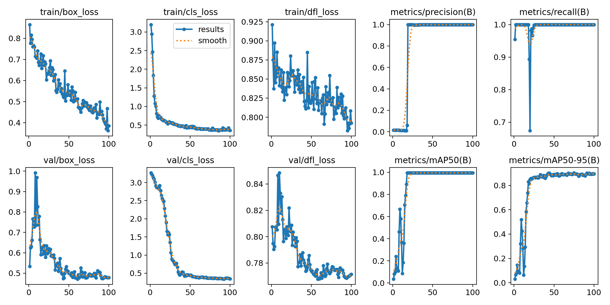

General Instructions
# Beyblade Battle Analysis Application

## Todo
- ✅ **Detect Beyblades**: Be able to detect beyblades in a video. The video is top-down view, 1v1 mode.
- ✅ **Game Over Detection**: Detect when the game is over, that is when one of the beyblades stops spinning, or end of video
- ✅ **Data Storage**: Store the output data in `CSV` and `json` file. The data include:
	- The duration of the battle
	- The winner of the battle
	- Bounding box of each beyblade in video
	- Frame index and timestamp of each row
	- Moving measurement
- ⌛ Apply multiprocessing to speedup program
- ⌛ Apply optimize techniques to archive faster speed
- ⌛ More detail docs
- ⌛ More general detection model
- ⌛ ...

## Model
1. I choose YOLO11n of Ultralytics because:
	- Latest YOLO models delivering state-of-the-art (SOTA) performance across multiple tasks.
	- Small, fast, can run on CPU only, enough accuracy
	- Lib have a lot of features
2. Data extract from the inference video. Those data maybe only fit on 1 video only (assignment purpose)
3. The accuracy of the beyblade detection model.

4. Reproduce:
	- Use `extract_image.py` to gen data from video
	- Run `train.sh`

## Run analyze (on python 3.11):
1. Install requirements: `pip install -r requirements.txt`
2. Run `python main.py`
	- results are stored in `battle_data.csv` and `battle_summry.json`

